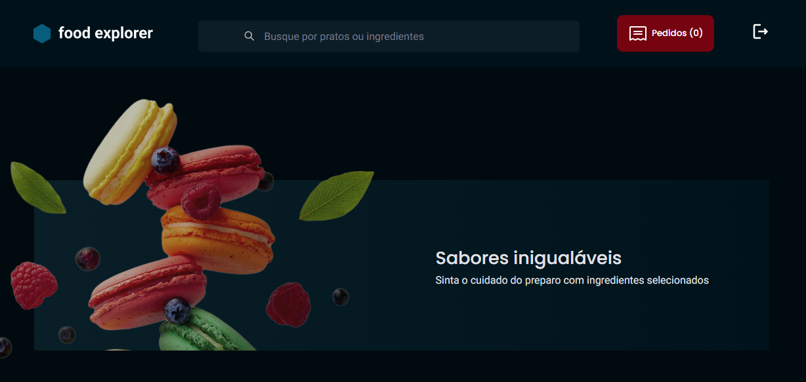

 
  

   
  

<!--  -->
<h1 align='center'>💻 Sobre</h1>

O Food Explorer é um site voltado para a experiência de restaurantes, onde os usuários podem visualizar os pratos disponíveis e fazer buscas de forma prática e rápida. Em breve, mais funcionalidades serão adicionadas para melhorar ainda mais a interação e a navegação.

Na área administrativa, é possível cadastrar novos pratos, editá-los e buscar por itens específicos, facilitando a gestão do cardápio de forma eficiente.

O repositório contém o Frontend em React.js e o Backend em Node.js.

---
<h2 align="center">Tecnologias 🚀</h2>
   

Esse projeto foi desenvolvido com as seguintes tecnologias:

- **React Router Dom**
- **React Router**
- **ReactJs**
- **Node.js**
- **Javascript**
- **Vite**
- **Express**
- **Nodemon**
- **SQLite**
- **Knex**
- **BCryptjs**
- **JSON Web Token**
- **Multer**
- **CORS**
- **Axios**
- **Styled Components**
- **React Icons**
- **slick-carousel**

  
  ---
  <h3 align="center">Projeto💻 </h3>
  
Acesse o projeto em <a href=""> site🌐
  

