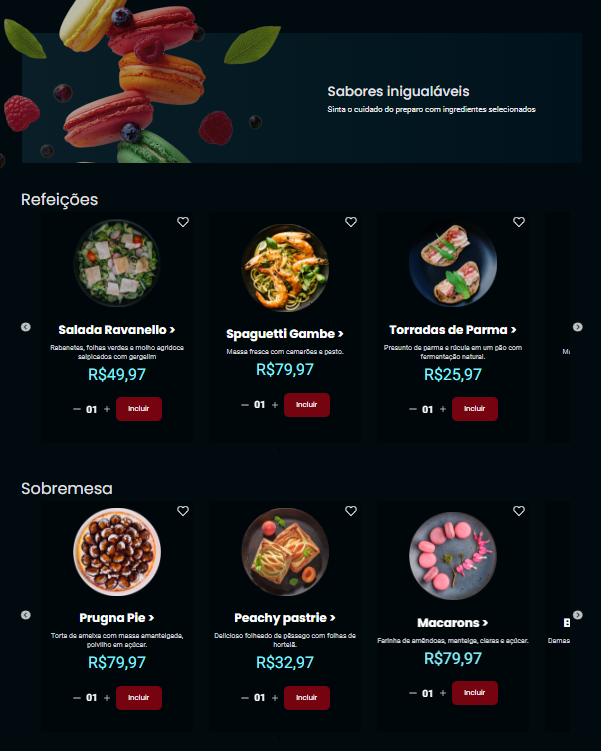

<p align="center"> 
 
</p>

---
<p align="center">
  Resultado final do desafio final do Explorer, o Food Explorer.
</p>


<!--  -->
<h1 align='center'>💻 Sobre</h1>
<p>
O Food Explorer é um site voltado para a experiência de restaurantes, onde os usuários podem visualizar os pratos disponíveis e fazer buscas de forma prática e rápida. Em breve, mais funcionalidades serão adicionadas para melhorar ainda mais a interação e a navegação.

Na área administrativa, é possível cadastrar novos pratos, editá-los e buscar por itens específicos, facilitando a gestão do cardápio de forma eficiente.

O repositório contém o Frontend em React.js e o Backend em Node.js.


</p>

<h1 align='center'>🎨 Layout</h1>

<p align="center"> 
  

</p>


---
<h1 align="center">Tecnologias 🚀</h1>
   
<p>Esse projeto foi desenvolvido com as seguintes tecnologias:</p>

- **React Router Dom**
- **React Router**
- **ReactJs**
- **Node.js**
- **Javascript**
- **Vite**
- **Express**
- **Nodemon**
- **SQLite**
- **Knex**
- **BCryptjs**
- **JSON Web Token**
- **Multer**
- **CORS**
- **Axios**
- **Styled Components**
- **React Icons**
- **slick-carousel**

---
<h1 align="center"> ⏬ Baixando o projeto</h1>

```bash
$ git clone git@github.com:micaelamarques/FoodExplorer.git
```
---
<p>O Backend foi hospedado no render. Já o Frontend foi hospedado no Netlify.</p>

---
<h1 align="center">🛠️ Executando o projeto</h1>

```bash
# No BackEnd insira uma porta e um secret no arquivo .env vazio
AUTH_SECRET=
PORT=

# Navegue até o diretório do BackEnd
$ cd foodExplorerApi

# Instale as dependências necessárias
$ npm install

# Agora inicie o servidor do BackEnd
$ npm run dev ou
$ yarn dev
```
---
<h1 align="center"> 🔐 Use a conta abaixo para logar como administrador: </h1>


```
  e-mail: admin@gmail.com
  senha: 123456

```


  
  ---
  <h1 align="center">Projeto💻 </h1>
  <p align="center">Acesse o projeto em <a href="https://projectfoodexplorer.netlify.app"> site🌐
   
  </p>
